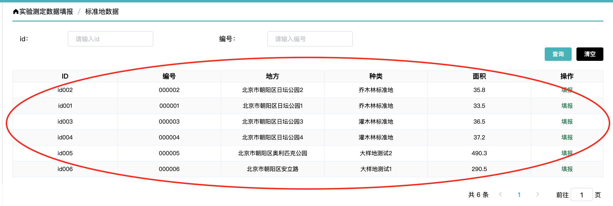

# 配置化组件说明

### 配置化组件目的

- 规范代码风格，便于项目长期稳定维护
- 熟悉之后提升数倍开发效率

### 可行性

- 大型互联网公司都会有自己的配置化方案
- 已有几个相对复杂的项目通过配置化实现并维护性较好

### 配置化组件原理说明

- 由于管理后台风格蕾西，通过把页面划分为 2 个大组件：xcy-form、xcy-list
- xcy-form 包含两部分: 1、table 上方的 filter 组件 2、表单的新建和编辑
- 
- 
- xcy-list 包含 table 部分
- 

### 配置化目录如下

- 
-  内部主要是通过组件库和 form 表单数据流打通，对于外界暴露关键数据接口，从而满足基本业务需求

### 常用配置方法：

#### form 配置

- 配置案例参考目录 src/pages/register
- 组件引入

```
import { formConfig } from './config';
data() {
    return {
        formConfig,
        formData: {}
    };
},
methods: {
  handleEditUpdate(formData) {
      this.formData = formData;
  },
}
<xcy-form
  class="registerForm"
  ref="registerForm"
  :config="formConfig"
  :data="formData"
  @input="handleEditUpdate"
/>
```

- 配置文件 config.js

```
export const formConfig = [
    {
        label: '登录名',
        prop: 'userName',
        type: 'input',
        width: '100px',
        placeholder: '请输入用户登录名',
        span: 24,
        rules: [{
            required: true,
            message: '请输入登录名'
        },
        { max: 20, message: '20字以内，可字母、数字、下划线', trigger: 'blur' }
        ]
    },
    {
        label: '密码',
        prop: 'password',
        type: 'input',
        span: 24,
        Attributes: {
            type: 'password',
            placeholder: '请输入密码'
        },
        rules: [{
            required: true,
            message: '请输入密码'
        }, {
            min: 6, max: 16, message: '6-16位字符', trigger: 'blur'
        }
        ]
    },
    {
        label: '确认密码',
        prop: 'dengLuMmAgain',
        Attributes: {
            type: 'password',
            placeholder: '请输入密码'
        },
        type: 'input',
        span: 24,
        rules: [{
            required: true,
            message: '请确认密码'
        }, {
            min: 6, max: 16, message: '6-16位字符', trigger: 'blur'
        }]
    }
    ...
];
```

- 效果如下:
- 

#### list 配置

- 配置案例参考目录 src/pages/experiment/standard
- 组件引入

```
  import { listPropsConfig} from './config';
  data() {
    return {
      listData: {
        list: [],
        total: 0
      }
    }
  }
  // 分页触发
  methods: {
    updatePageInfo(pageInfo) {
      this.pageInfo = {...this.pageInfo, page: pageInfo.currentPage};
      this.handeleQuery();
    }
  }
  // 操作区回调
  handleAction({ action, data }) {
      switch (action) {
          case 'flexible':
            ...
            break;
      }
  },
  <xcy-list
    :data="listData"
    :props="listPropsConfig"
    :pagerInfo="pageInfo"
    @action="handleAction"
    :hasPager="true"
    @updatePagerInfo="updatePageInfo"
  ></xcy-list>
```

- 配置区

```
export const listPropsConfig = [
  {
    label: "ID",
    prop: "guid",
  },
  {
    label: "编号",
    prop: "bianHao",
  },
  {
    label: "地方",
    prop: "address",
  }
  ...
];
```

- 效果如下
- 

### filter 配置

- filter 其实是 form 的包装，多了两个按钮，因此配置和 form 完全一样，只不过多了两个事件回调
- 参考案例还是可以参考 src/pages/experiment/standard

### 关于组件库说明

- 组件库其实就是对 element-ui 组件库的包装，相当于是一个 adpter，接通通 form 和 element 组件库，在这一层你可以做一些公司业务特性的事情。

#### 如何配置组件

- 通过之前采伐项目的积累，基本上目前的组件库大体够用，如果有新的组件也可以继续扩展。
- 目前组件库分为两类一类为公共组件，即项目通用组件在 src/components/common 目录下
  - 对于公共组件此项目有如下, 在 src/components/xcy-form/base.vue 中可见
  ```
    const componentsTypeMap = {
      input,
      select,
      radio,
      dataPickter,
      dataPickter2,
      doubleInput,
      html,
      table,
      danWei,
      registerLink,
      checkbox,
      postion
    };
  ```
  - 如果需要配置，则在对应 config.js 中通过 type 熟悉进行配置，如下为配置一个 input 组件，其中的属性是通过数据流透传进 src/components/common/input 组件中，理论上配置项由书写组件的人定义，一般来讲透传兼容 element 组件库配置。
  ```
  {
      label: '手机',
      prop: 'mobileNumber',
      type: 'input',
      placeholder: '请输入手机号',
      rules: [{
          required: true,
          message: '请输入电话'
      }, {
          pattern: /^1(3|4|5|6|7|8|9)\d{9}$/,
          message: '请输入正确电话格式',
          trigger: 'blur'
      }],
      span: 24
  },
  ```
- 还有一类为业务组件，可能只是针对某一个页面的，即可以在对应页面目录下书写。
- 此项目咱没有配置案例，有需要可以参考采伐的配置, 主要是通过 components 配置项实现
- 如下，配置的是一个自定义的 input 组件

```
import myInput form './input'
{
    label: '手机',
    prop: 'mobileNumber',
    components: myInput,
    placeholder: '请输入手机号',
    span: 24
},
```

#### 如何写一个配置组件

- 案例可以直接参考 src/components/common/input
- 对于配置组件来讲上层组件会透传 3 个关键属性，value ｜当前组件 onchange 的值、data|当前 form 的所有数据、prop|当前组件在 config.js 中配置的属性, 而 watch 主要是两个事情，通过监听当前值变化向上层组件发事件，监听到上层组件变化更新 data 的值。
- 关键代码

```
props: {
    value: {
        type: [String, Number],
        default: ''
    },
    data: {
        type: Object,
        default() {
            return {};
        }
    },
    prop: {
        type: Object,
        default() {
            return {};
        }
    }
},
watch: {
    input: function (val) {
        this.$emit('input', val);
        this.$emit('change', val);
    },
    value: function (val) {
        this.input = val;
    }
}
```

### 使用建议

- 配置化组件有优点也有缺点，优点显而易见，熟练以后会很快，同时最关键一点，在多人协同开发中，通过框架唯独约束每个人的开发规范，对于项目长期维护角度来讲，对公司收益是不可限量的。
- 缺点则不适合联动比较复杂的 form，不过也能实现，针对这种场景建议单独写成自定义业务组件，再通过规范打通数据流。
- 配置是死的，但是人是活的，在事件场景中可以对 form 拆分成多个小配置 form，从而降低一些开发和维护成本。参考： src/pages/experiment/standard 中拆分成 3 个组件
- 实现可视化编辑的页面，此成本较高，有兴趣可以参考阿里飞冰

### 可以后期优化的点

- 在扩展公共组件的同时，可以从几个纬度去优化配置化组件。
- 其实在很多场景下，我们的页面的场景都是类似的，而目前只是细分到组件纬度，可以基于 xcy-list 和 xcy-form 直接配置 page 纬度的配置化功能，这样一个页面可能会是更少的配置项就实现，从而效率能再提升。
- 目前没有详情的配置，可以考虑统一详情页面，做一个配置详情
- 通过脚手架的方式对项目进行自动化，并把配置组件作为脚手架的一个选项，从而每次起新项目的时候，就可以通过交互选项卡的方式来搭建你想要的项目。
